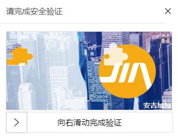

## anji-plus-captcha

anji-plus-captcha是一款由安吉加加信息技术有限公司开源的一款行为验证码组件，易于集成使用；此开源插件提供了多种实现，包含vue/h5/Andriod/ios/flutter/ui-app等，可以根据不同需求参考对应的实现方式。

**项目开源地址：**https://gitee.com/anji-plus/captcha

**电脑端在线体验地址：**https://mirror.anji-plus.com/captcha-web/

#### 1. 行为验证码

行为验证码采用嵌入式集成方式，接入方便，安全，高效。抛弃了传统字符型验证码展示—>填写字符—>比对答案的流程，采用验证码展示—>采集用户行为—>分析用户行为流程，用户只需要产生指定的行为轨迹，不需要键盘手动输入，极大优化了传统验证码用户体验不佳的问题；同时，快速、准确的返回人机判定结果。

#### 2.  组件分类

此款开源组件目前提供了两种类型的验证码，分别是滑动拼图、文字点选两种方式，如下图：

同时每种方式又提供了两种展示方式：**固定式** 和 **弹出式**。




#### 3. 调研选择

目前根据项目的实际需求考虑，认为选择弹出式的方式最好，在不改变项目原有布局的情况下，增加jquery代码实现点击登录按钮弹出验证码，验证成功后再做后台登录验证。后台部分只需要新增一个校验的方法即可，改动最小。

##### 前端实现方案（基于Html集成）：

###### 1. 兼容性

    IE8+、Chrome、Firefox.(其他未测试)

###### 2. 引入对应的css以及js文件

    在view/html文件夹copy到自己项目中
    1)引入css文件verify.css
    2)按顺序引入js文件下js文件 jquery.min.js, crypto-js.js, ase.js, verify.js

基础示例

```javascript
准备初始化的容器，以及id值

<div id="content"></div>
// mode="pop" 模式配置点击
<button id="btn">点击出现验证码</button>
       
滑动式调用$('#content').slideVerify(option)初始化; 
点选式调用$('#content').pointsVerify(option)初始化;

//option为配置对象{},参数详见下方验证码参数
<script> 
    $('#content').slideVerify({
    	//服务器请求地址, 默认地址为安吉服务器;
        baseUrl:'https://mirror.anji-plus.com/captcha-api', 
    	//pop模式 必填 被点击之后出现行为验证码的元素id
        containerId:'btn',
   		//展示模式
        mode:'pop',     
        imgSize : {//图片的大小对象,有默认值{ width: '310px',height: '155px'},可省略
            width: '400px',
            height: '200px',
        },
        barSize:{//下方滑块的大小对象,有默认值{ width: '310px',height: '50px'},可省略
            width: '400px',
            height: '40px',
        },
        beforeCheck:function(){  //检验参数合法性的函数  mode ="pop"有效
            let flag = true;
            //实现: 参数合法性的判断逻辑, 返回一个boolean值
            return flag
        },
        ready : function() {},  //加载完毕的回调
        success : function(params) { //成功的回调
            // params为返回的二次验证参数 需要在接下来的实现逻辑回传服务器
            例如: login($.extend({}, params))  
        },
        error : function() {}        //失败的回调
    });
</script> 
```

###### 3. 回调事件

| 参数            | 类型     | 说明                                                         |
| --------------- | -------- | ------------------------------------------------------------ |
| success(params) | funciton | 验证码匹配成功后的回调函数,params为返回需回传服务器的二次验证参数 |
| error           | funciton | 验证码匹配失败后的回调函数                                   |
| ready           | funciton | 验证码初始化成功的回调函数                                   |
| beforeCheck     | funciton | mode="pop"模式有效, 调用验证码前检验参数合法性的函数,返回值为boolean值,默认返回ture |


###### 4. 验证码参数

| 参数        | 类型   | 说明                                                         |
| ----------- | ------ | ------------------------------------------------------------ |
| baseUrl     | String | 请求后端的服务器地址,默认:'https://mirror.anji-plus.com/captcha-api' 安吉服务器地址 |
| mode        | String | 验证码的显示方式，弹出式pop，固定fixed，默认：mode : ‘pop’   |
| containerId | String | mode="pop" 模式必填,被点击之后出现行为验证码的元素id         |
| vSpace      | String | 验证码图片和移动条容器的间隔，默认单位是px。如：间隔为5px，默认:vSpace:5 |
| explain     | String | 滑动条内的提示，不设置默认是：'向右滑动完成验证'             |
| imgSize     | Object | 其中包含了width、height两个参数，分别代表图片的宽度和高度，如:{width:'400px',height:'200px'} |
| barSize     | Object | 其中包含了width、height两个参数，分别代表图片的宽度和高度，如:{width:'400px',height:'200px'} |

###### 5. 默认接口api地址

| 请求URL        | 请求方式 |
| -------------- | -------- |
| /captcha/get   | Post     |
| /captcha/check | Post     |